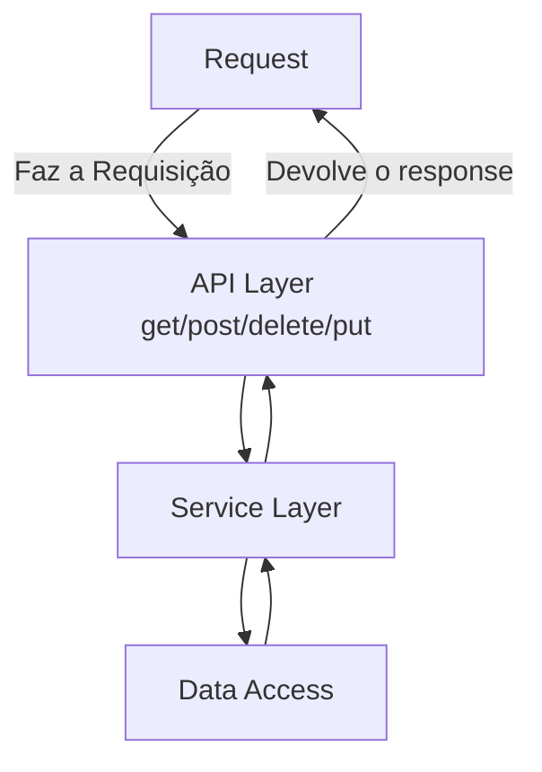

# API LIVRARIA!

Este é um estudo de API REST para uma livraria. Nesta primeira versão apenas foi criado algumas funções para persistir e consumir os livros. 

## Tecnologia
Fara criação desta API REST utilizei:

  - [x] Java 8+
  - [x] SpringBoot 2.3.1
  - [x] Swagger 2.9.2
  - [x] Postgres
  - [x] Heroku
 
 Link para aplicação:
 [https://apirest-livraria.herokuapp.com/swagger-ui.html](https://apirest-livraria.herokuapp.com/swagger-ui.html)
 
## Funcionamento da API

